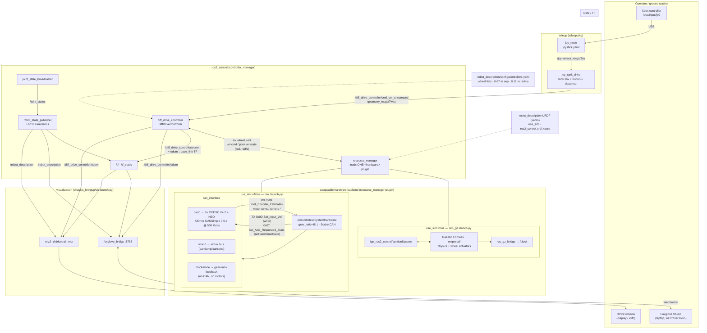
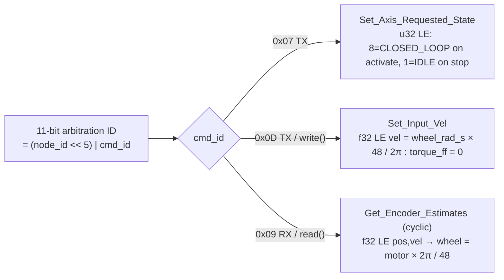

# URC-2027

## General Usage

It is generally reccomnded

### System Requirements

for full support:

1. Ubuntu 24+ base OS on device 
2. CUDA v13 (13.2)
3. Docker Engine 
4. VScode with Remote Development Extension group installed

### Pixi

This project uses pixi as the package manager, please make sure that the python interpreter is configured to point to `.pixi/envs/default/bin/python3` in the devcontainer 

For more information about pixi please look at:
1. [Pixi Cheatsheet](docs/PixiCheatSheet.md)
2. [Pixi in VSCode](https://pixi.prefix.dev/latest/integration/editor/vscode/#python-extension)

### Running the drivetrain

See **[docs/RUN_GUIDE.md](docs/RUN_GUIDE.md)** — step-by-step for the simulation (no
hardware) and the real ODESC drivetrain, followed by a full breakdown of how each launch
file works.

## Drivetrain architecture

One control stack, three interchangeable backends. `diff_drive_controller` only ever
sees wheel-joint `position`/`velocity` interfaces, so the **same controller, topics,
odometry and TF** work whether the numbers come from Gazebo physics, a real Hall
encoder over CAN, or a hardware-free loopback. The backend is chosen by the
`use_sim` xacro arg (`sim_gz.launch.py` → Gazebo; `real.launch.py` → CAN) and, for
the real path, the `can_interface` launch arg (`can0` real / `vcan0` virtual bus /
`mock` loopback).



**Layers, bottom to top:** physical/OS (`can0` via `tooling/can-up`, Tegra `mttcan`
@ 500 kbit/s) → driver (`odesc/OdescSystemHardware`, ODrive CANSimple subset, the
only place the **48:1** motor↔wheel gear ratio is applied) → `ros2_control`
(`resource_manager` + `diff_drive_controller` + `joint_state_broadcaster`, config in
`controllers.yaml`) → ROS graph (`/…/cmd_vel_unstamped`, `/…/odom`, `/joint_states`,
`/tf`) → teleop (`joy_node` → `joy_tank_drive`) and visualization
(`foxglove_bridge` :8765 for the remote ground station, `rviz2` for a local
display). Canonical CAN node-ID ↔ wheel map: `ros2_ws/src/odesc/config/node_map.yaml`.

### CAN frame layout (ODrive CANSimple, real backend)




## Apple-Silicon Mac — headless ground station

The default devcontainer is for Linux hosts with an NVIDIA GPU and a ZED camera.
On an Apple-Silicon Mac, use the `Mac` configuration in
`.devcontainer/mac/devcontainer.json` (VS Code: **Dev Containers: Reopen in
Container**, then **desktop-roshumble-mac-cpu**). It uses the `mac-cpu` Pixi
environment (shared `aarch64-cpu` feature — same package set as the Jetson `l4t`
env, so the build behaves the same).

```sh
cd ros2_ws
pixi install --environment mac-cpu
pixi run --environment mac-cpu build
```

**What runs** (all headless, in the container):

- **Headless Gazebo sim** — wrap launches in `xvfb-run -a`; the image ships `xvfb`
  and a mesa `llvmpipe` software renderer. Slow, and camera sensors are marginal,
  but the drivetrain + physics run.
- The full **`ros2_control` stack** (`diff_drive_controller`, mock/sim backends,
  `/odom`, `/tf`) and **`foxglove_bridge`** on `:8765` (forwarded to the macOS host).
- **Keyboard teleop** — `teleop_twist_keyboard` (reads stdin), remapped to
  `/diff_drive_controller/cmd_vel_unstamped`.

**What does not** (by design — Docker Desktop on macOS):

- **RViz** — no X server. Use Foxglove Studio (the macOS app) → `ws://localhost:8765`
  and build the operator view there. Skip RViz in the launch with `rviz:=false`.
- **USB gamepad** — `/dev/input/js*` is not passed into the container. Use keyboard
  teleop, or Foxglove Studio's Teleop / Gamepad panel (publishes `Twist` through the
  bridge).
- **Direct DDS to a real rover** — no host networking. A Mac views a *remote* rover
  only through the Foxglove bridge (`ws://<rover-ip>:8765`); it cannot join the
  rover's DDS graph.

Two ways to use it:

1. **Self-contained sim** — one container runs sim + control + bridge; Foxglove
   Studio on the host connects to `ws://localhost:8765`; drive with keyboard teleop.
2. **Remote viewer** — just point Foxglove Studio at the rover's `ws://<rover-ip>:8765`.

See [docs/RUN_GUIDE.md](docs/RUN_GUIDE.md) → "Mac (Apple Silicon)" for the commands.

## NVIDIA Jetson (L4T) rover devcontainer

For the rover itself — an NVIDIA Jetson (Orin-family or Thor) flashed with
**JetPack 7.2 / L4T r39.2.x** — use the `l4t` configuration in
`.devcontainer/l4t/devcontainer.json` (VS Code: **Dev Containers: Reopen in
Container**, then select **rover-roshumble_l4t-aarch64**).

It mirrors the default devcontainer's pixi/RoboStack structure but builds
`docker/Dockerfile.l4t-humble` (base `nvcr.io/nvidia/l4t-jetpack:r39.2.1`) and
forwards the GPU with the `nvidia` container runtime instead of `--gpus all`
(unreliable on JetPack 7). ROS 2 Humble comes from the aarch64 `l4t` Pixi
environment (shared `aarch64-cpu` feature). The ZED SDK is gated off
(`--build-arg INSTALL_ZED=true` once a matching L4T r39 SDK ships).

Host prep on the Jetson (one-time — **already done on the current BILLEE Orin Nano**):

```sh
sudo apt install -y nvidia-container curl   # JetPack 7.2: pulls nvidia-container-toolkit
                                            # and runs nv-install-docker.service (installs
                                            # Docker CE + wires the nvidia runtime)
# then, for GPU access at build time too:
#   /etc/docker/daemon.json -> "default-runtime": "nvidia"
sudo usermod -aG docker "$USER"   # then log out / back in
docker run --rm --runtime nvidia ubuntu:24.04 nvidia-smi   # smoke test
```

> On JetPack 7 use `--runtime nvidia`, not `--gpus all`.

The native (no-container) path is also fully set up on this Jetson: Pixi is installed and
the `l4t` environment is built — see [docs/RUN_GUIDE.md](docs/RUN_GUIDE.md).

Inside the container (first build throttled — Orin Nano has 8 GB RAM):

```sh
cd ros2_ws
pixi run --environment l4t -- colcon build --symlink-install \
  --parallel-workers 2 --executor sequential \
  --event-handlers console_direct+ --base-paths src \
  --cmake-args ' -DCMAKE_BUILD_TYPE=Release'
pixi run --environment l4t build            # later incremental builds
pixi run --environment l4t ros2 launch chassis_bringup real.launch.py            # real ODESC/CAN
pixi run --environment l4t ros2 launch chassis_bringup real.launch.py can_interface:=mock  # no motors
pixi run --environment l4t ros2 launch chassis_bringup viz.launch.py            # rviz + foxglove :8765
```

Set the VS Code Python interpreter to `.pixi/envs/l4t/bin/python3`.
On the ground station (x86 laptop, default devcontainer) open Foxglove Studio and
connect to `ws://<rover-ip>:8765`.

Without VS Code, `tooling/rover-ros2 build|run|shell` builds and runs the same image.
