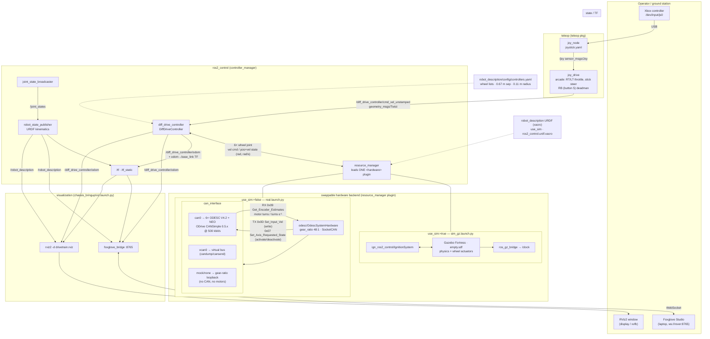

# BILLEE Software 2027

ROS 2 Humble software for the BILLEE rover (URC 2027): the drivetrain control stack,
Gazebo simulation, teleop and ground-station tooling. One workspace (`ros2_ws/`) runs on
the rover (NVIDIA Jetson), on x86 Linux and Windows (WSL2) machines with an NVIDIA GPU,
and on Apple-Silicon Macs. Every machine runs it in a container.

## Quick start

```sh
git clone https://github.com/BILLEE-BroncoSTAR/billee-software-2027.git
cd billee-software-2027
make setup <l4t | x86 | wsl | mac>             # once per machine - see Setup below
make sim                                       # simulated rover + this machine's viewer
#   ...or, against a real rover: `make ground` here, `make rover` on the Jetson
```

Then drive it (see [Run modes](#run-modes)). `make help` lists every command.

| Command | What it does |
|---|---|
| `make setup <platform>` | One-time setup of this machine: host packages, Pixi/Docker image, workspace build |
| `make build` | Rebuild `ros2_ws` after code changes |
| `make shell` | A shell with ROS 2 and the workspace sourced (`ros2 launch …` works as-is) |
| `make sim` | Gazebo sim + gamepad teleop + Foxglove bridge (:8765); opens RViz on Linux with a display |
| `make ground` | Ground station against a real rover: viewers + game pad, no Gazebo |
| `make rover` | Jetson only: real drivetrain over CAN + Foxglove bridge, no viewer |

All of them follow the platform you set up and run inside that platform's container,
defined in [`docker/compose.yaml`](docker/compose.yaml) (`make up` / `make down` start and
stop it; see [docs/docker.md](docs/docker.md)).

**Two deployments.** The **Jetson is the rover** — real drivetrain over CAN, headless,
no Gazebo and no RViz in its environment. **Everything else is a ground station** (x86
Linux, WSL2, or the Mac container) and runs the viewers, the game pad and
the Gazebo sim. `make rover` only works on the Jetson; `make sim` / `make ground` only
work on a ground station, and each tells you which one you wanted. Full breakdown of
what runs where: [Deployment split](docs/RUN_MODES.md#deployment-split-rover-vs-ground-station).

## Setup

Pick your machine. Each section is the whole process, top to bottom.

| Platform | Machine | Runs | Viewer |
|---|---|---|---|
| [`l4t`](#nvidia-jetson-rover-l4t) | NVIDIA Jetson rover | Docker container (`l4t` env) | Foxglove / RViz on the ground station |
| [`x86`](#x86-64-linux--nvidia-x86) | x86-64 Linux + NVIDIA GPU (ground station) | Docker container (`default` env) | RViz (+ Foxglove) |
| [`wsl`](#windows--wsl2--nvidia-wsl) | Windows + WSL2 + NVIDIA GPU (ground station) | Docker container (`default` env) | RViz on WSLg (+ Foxglove) |
| [`mac`](#apple-silicon-mac-mac) | Apple-Silicon Mac | Docker container (`mac-cpu` env) | Foxglove Studio |

Need `make` first? `xcode-select --install` (Mac) or `sudo apt install -y make` (Linux).

### NVIDIA Jetson rover (`l4t`)

The rover itself: an Orin-family Jetson on **JetPack 6 (L4T r36.x)**. The image installs
the ZED SDK built for the L4T release set in `docker/compose.yaml` (`L4T_MAJOR`/`L4T_MINOR`,
default 36.4 — ZED SDK 5.4 publishes no 36.3 build). Check it against the Jetson with
`cat /etc/nv_tegra_release`; a release with no ZED build fails the image build.

**Needs:** the one-time host prep below (**already done on the current BILLEE Orin Nano**).

1. **Set up:** checks the Docker `nvidia` runtime, installs `can-utils kmod`, builds
   `rover-ros2:latest`, then the `l4t` env inside it (first build uses 2 workers,
   sequential, to fit in RAM):
   ```sh
   make setup l4t
   ```
2. **Run:** `tooling/can-up` (brings `can0` up), then `make shell` and
   `ros2 launch chassis_bringup rover.launch.py mode:=real`. The rover is headless:
   view from the ground station with Foxglove (`ws://<rover-ip>:8765`) or RViz over DDS.
3. **VS Code (optional):** **Reopen in Container → rover-roshumble_l4t-aarch64**;
   interpreter `ros2_ws/.pixi/envs/l4t/bin/python3`.

### x86-64 Linux + NVIDIA (`x86`)

The ground-station setup: GPU-accelerated Gazebo, RViz, the gamepad and F' GDS.

**Needs:** Ubuntu 24.04 or newer, an NVIDIA GPU, `sudo`, and `make`
(`sudo apt install -y make`). Everything else is installed for you. On Windows/WSL2, use
[`wsl`](#windows--wsl2--nvidia-wsl) instead (`make setup x86` refuses to run there). Optionally VS Code +
Remote Development extensions.

1. **Set up:**
   ```sh
   make setup x86
   ```
   First, `tooling/install-x86-host` prepares the machine. Each step is skipped when it's
   already done:

   | Step | Installs |
   |---|---|
   | Base packages | `curl`, `gnupg`, `make`, `can-utils`, `kmod`, `xhost`, `ubuntu-drivers-common` |
   | NVIDIA driver | Ubuntu's recommended driver (`ubuntu-drivers install`), only if the current one doesn't support the image's CUDA version (13.2, read from `docker/Dockerfile.desktop.humble`) |
   | Docker Engine | from Docker's apt repository, and adds you to the `docker` group |
   | NVIDIA Container Toolkit | from NVIDIA's apt repository, registered as Docker's `nvidia` runtime |
   | Smoke test | `nvidia-smi` inside a container with `--gpus all` |

   A new driver needs a **reboot** and a new group needs a **re-login**: setup stops and
   tells you which. Do it, then run `make setup x86` again; it continues from where it
   stopped. Then it builds `billee-desktop:latest` (CUDA + ZED SDK) and the `default` env
   inside it.

   - Preview without changing anything: `DRY_RUN=1 tooling/install-x86-host`
   - Pick a driver branch instead of Ubuntu's recommendation:
     `NVIDIA_DRIVER_BRANCH=<n> make setup x86` (runs `ubuntu-drivers install nvidia:<n>`)
   - With **Secure Boot** on, the driver install asks for a password, and on the next boot
     you choose **Enroll MOK** and enter it.
   - Already set up by hand, or not on Ubuntu: `make setup x86 SKIP_APT=1` skips this step
     and only checks that Docker and the `nvidia` runtime work.
2. **Run:** `make sim` (Gazebo + **RViz**), or `make shell` and e.g.
   `ros2 launch chassis_bringup ground_station.launch.py` to operate the real rover.
3. **VS Code (optional):** **Reopen in Container → desktop-roshumble_dev-x862** starts
   the same compose service, image and environment. Python interpreter `ros2_ws/.pixi/envs/default/bin/python3`.

### Windows + WSL2 + NVIDIA (`wsl`)

A Windows PC with an NVIDIA GPU as the ground station. It uses the same image and Pixi
environment as `x86`. The GPU comes from the Windows driver, and Gazebo/RViz windows open
through WSLg.

**Needs:** Windows 11 (or 10 with WSLg), an Ubuntu WSL2 distro, the NVIDIA driver
**installed on Windows** (never inside WSL), Docker Desktop with **Settings → Resources →
WSL integration** turned on for your distro, and `make` in the distro
(`sudo apt install -y make`). Nothing else is installed on the host.

1. **Set up** (from the repo inside the WSL filesystem, e.g. `~/billee-software-2027`,
   not `/mnt/c/...`):
   ```sh
   make setup wsl
   ```
   It only checks the host: that the Windows driver supports the image's CUDA version,
   that Docker is reachable from WSL, and that a container sees the GPU. Each failure says
   what to fix. Then it builds `billee-desktop:latest` and the `default` env inside it.
2. **Run:** `make sim` (Gazebo + **RViz** on WSLg + Foxglove on :8765), or `make shell`.
3. **VS Code (optional):** **Reopen in Container → desktop-roshumble_dev-wsl**; interpreter
   `ros2_ws/.pixi/envs/default/bin/python3`.

**Limits of WSL2:** the stock WSL kernel has no `vcan` and no joystick driver. That means
no ODESC shadow or vCAN bench, and the game pad drives through Foxglove's
**Joystick** panel (`sim-up`/`ground-up` pick `joy_source:=browser` on `wsl`; see
[RUN_MODES → T4b](docs/RUN_MODES.md#t4b--real-gamepad-through-the-browser)). DDS to other
machines needs WSL's mirrored networking (`networkingMode=mirrored` in `.wslconfig`).

### Apple-Silicon Mac (`mac`)

The Mac runs the simulation headless in a container and you view and drive it in
**Foxglove Studio** on the Mac.

**Needs:** Docker Desktop, [Foxglove Studio](https://foxglove.dev/download) (free
account), and optionally VS Code + the Dev Containers extension.

1. **Set up** (builds the `billee-mac-cpu` image, then the workspace inside it; the first
   run takes a while):
   ```sh
   make setup mac
   ```
2. **Start the sim.** Either from the Mac terminal:
   ```sh
   make sim
   ```
   or in VS Code: **Dev Containers: Reopen in Container → desktop-roshumble-mac-cpu**
   (the same compose service and image as step 1), then in a container terminal:
   ```sh
   make sim
   ```
   Both run Gazebo headless (`xvfb-run`) with the `foxglove_bridge` on port **8765**,
   which is published to the Mac (`make sim`: Docker port mapping; VS Code: the
   devcontainer's `forwardPorts`). Wait for `diff_drive_controller` to report active.
3. **Connect Foxglove.** In Foxglove Studio: **Open connection → Foxglove WebSocket →**
   `ws://localhost:8765` → **Open**.
4. **Load the layout.** **Layouts → Import from file →**
   `ros2_ws/src/chassis_bringup/foxglove/drivetrain.json`. You get the grid, TF, the
   robot model (from `/robot_description`) and the odometry trail. If the robot shows
   as bare axes, see [RUN_GUIDE → Troubleshooting](docs/RUN_GUIDE.md#troubleshooting).
5. **Drive.** Either
   - add a **Teleop** panel and set its topic to `/diff_drive_controller/cmd_vel_unstamped`, or
   - open a second terminal (`make shell` joins the running sim container, or open a new
     VS Code container terminal) and run
     ```sh
     ros2 run teleop_twist_keyboard teleop_twist_keyboard \
       --ros-args -r /cmd_vel:=/diff_drive_controller/cmd_vel_unstamped
     ```

**Limits of the Mac container:** no USB gamepad, no `vcan0`, no RViz window, and no DDS
to other machines (Docker Desktop has no host networking). Other machines *can* open
the Mac's sim in Foxglove at `ws://<mac-ip>:8765` when it was started with `make sim`
(VS Code only forwards to `localhost`). To view the real rover, connect Foxglove to
`ws://<rover-ip>:8765` instead. For the fastest loop without Gazebo, use the mock
drivetrain: `ros2 launch chassis_bringup rover.launch.py mode:=real can_interface:=mock`.

### How setup works

- `make setup <platform>` records the platform in `ros2_ws/.billee-platform`
  (gitignored). `make build/shell/sim`, `tooling/sim-up`, `tooling/desktop-ros2` and the
  container shell config all read it through `tooling/billee-env.sh`, so nothing has to be
  edited per machine. Without the file they detect it (x86-64 → `x86`, or `wsl` under
  WSL2; Jetson → `l4t`; other ARM64 → `mac`); `BILLEE_PLATFORM=<platform>` overrides one
  command.
- Each platform has its own Pixi environment, named after it except where noted:

  | Platform | Pixi environment | Packages |
  |---|---|---|
  | `l4t` | `l4t` | same package list, locked separately so the rover only changes when tested on it |
  | `x86`, `wsl` | `default` | linux-64 + CUDA 13 (both use the `billee-desktop` image) |
  | `mac` | `mac-cpu` | linux-aarch64, CPU-only (runs in the Mac's Linux container) |

  Switching a checkout to another environment is safe: `make setup`/`make build` notice a
  build made with a different environment and rebuild from scratch.
- Each platform's container is one service in [`docker/compose.yaml`](docker/compose.yaml)
  (`x86`, `wsl`, `mac`, `rover`), which holds every build and run setting. `make`,
  `tooling/desktop-ros2 build|up|down|run|shell` and the VS Code devcontainers all start
  that same service, which mounts the repo at `/workspaces/billee-software-2027`, so the
  Pixi env and `install/` work from all of them (`tooling/rover-ros2` = `desktop-ros2`
  pinned to `l4t`). Details: [docs/docker.md](docs/docker.md).
- One checkout = one platform. The Pixi env and colcon `install/` are built for one
  platform's container, so switching a checkout to another platform means a reinstall
  (`make setup <platform>` does it).
- `SKIP_APT=1` skips the apt step. More on Pixi: [cheat sheet](docs/PixiCheatSheet.md),
  [Pixi in VS Code](https://pixi.prefix.dev/latest/integration/editor/vscode/#python-extension).

## Run modes

The stack runs in several modes, which you combine: a **chassis** mode (what drives the
wheels), a **teleop** mode (who commands it) and a **viewer**. They all share one
interface: commands in on `/diff_drive_controller/cmd_vel_unstamped`, odometry, joint
states and TF out. Full commands, per-platform support and recipes:
**[docs/RUN_MODES.md](docs/RUN_MODES.md)**.

| Chassis mode | Command (in `make shell`) | For |
|---|---|---|
| **Simulation** | `ros2 launch chassis_bringup rover.launch.py` (or `make sim`) | developing anything above the drivetrain |
| **Sim + ODESC shadow** | `tooling/can-up vcan0` → `tooling/sim-up` | checking the real CAN frames against Gazebo |
| **Real drivetrain** | `tooling/can-up` → `ros2 launch chassis_bringup rover.launch.py mode:=real` | the rover (6× ODESC + NEO on `can0`) |
| **Mock drivetrain** | `ros2 launch chassis_bringup rover.launch.py mode:=real can_interface:=mock` | the real stack with no CAN, motors or Gazebo; runs anywhere |
| **Virtual CAN bench** | `… mode:=real can_interface:=vcan0` + `ros2 run odesc odesc_vcan_emulator.py` | the full CAN loop without hardware |

| Teleop mode | How |
|---|---|
| **Gamepad** (same machine) | automatic with the sim; else `ros2 launch teleop teleop.launch.py`. Hold **RB/R1** (deadman); **RT** forward, **LT** reverse, **left stick** steers |
| **Ground station** (over DDS) | `ros2 launch chassis_bringup ground_station.launch.py` (teleop + RViz + Foxglove; `use_sim_time:=false` for a real rover) |
| **Keyboard** | `ros2 run teleop_twist_keyboard teleop_twist_keyboard --ros-args -r /cmd_vel:=/diff_drive_controller/cmd_vel_unstamped` |
| **Foxglove Teleop panel** | topic `/diff_drive_controller/cmd_vel_unstamped` |
| **Scripted** | `ros2 topic pub -r 10 /diff_drive_controller/cmd_vel_unstamped geometry_msgs/msg/Twist '{linear: {x: 0.4}}'` |

Viewers: **Foxglove Studio** at `ws://<host>:8765` with
`chassis_bringup/foxglove/drivetrain.json` (Mac, remote/radio link), **RViz** with
`rviz:=true` (Linux with a display), and the **F' GDS** web UI with
`ground_station.launch.py fprime_gds:=true`. The step-by-step two-machine procedure
(rover + ground station) is in [docs/RUN_GUIDE.md](docs/RUN_GUIDE.md).

## Repository layout

```
billee-software-2027/
├── Makefile                  make setup/build/shell/sim - start here
├── .devcontainer/            VS Code devcontainers: x86/, wsl/, mac/, l4t/ (compose services)
├── docker/                   compose.yaml (every platform's container), Dockerfiles, shell config
├── tooling/
│   ├── billee-env.sh         resolves platform -> workspace + Pixi env + role (sourced by the rest)
│   ├── desktop-ros2          build/up/down/run/shell the platform's compose service without VS Code
│   ├── container-init        installs the Pixi env on container start (make + devcontainers)
│   ├── rover-ros2            desktop-ros2 pinned to l4t
│   ├── install-x86-host      x86 host prep: NVIDIA driver, Docker, NVIDIA Container Toolkit
│   ├── sim-up                [ground] sim with the platform's viewer (+ ODESC shadow if vcan0 exists)
│   ├── ground-up             [ground] viewers + game pad against a rover on the network
│   ├── rover-up              [rover]  real drivetrain over CAN + Foxglove bridge, no viewer
│   └── can-up, can0.service  bring can0 / vcan0 up (host), persist can0 across reboots
├── docs/                     RUN_MODES (all modes), RUN_GUIDE (two-machine procedure), references
└── ros2_ws/                  the ROS 2 workspace (Pixi project: pixi.toml / pixi.lock)
    └── src/
        ├── chassis_bringup/  launch files (rover, ground_station, sim_gz, real, viz, odesc_shadow),
        │                     bridge/teleop config, RViz + Foxglove layouts
        ├── robot_description/ URDF/xacro, meshes, ros2_control + controllers.yaml
        ├── odesc/            ros2_control hardware plugin for the ODESC/ODrive CAN drives,
        │                     mock backend, vCAN emulator, CAN node map
        ├── navigation/       robot_localization EKF: fuses wheel odometry, VIO and IMU into
        │                     the odom -> base_link transform. Nav2 config lives here too
        ├── perception/zed2i/ synthetic VIO: degrades Gazebo ground truth into a realistic
        │                     noisy/drifting pose stream so the EKF sees ZED-like error in sim
        ├── comms/            serial device driver + GPS (NavSatFix). Work in progress -
        │                     the node is not built yet, see the package README
        └── teleop/           joy_drive: gamepad -> Twist, arcade or tank (RB deadman)
```

Each package has its own README with its nodes, topics and parameters.

## Software stack

| Layer | Technology |
|---|---|
| Middleware | ROS 2 Humble (from [RoboStack](https://robostack.github.io/) via Pixi, not apt), Fast DDS, `ROS_DOMAIN_ID=42` |
| Environments | [Pixi](https://pixi.sh) 0.76.1 (pinned in `docker/compose.yaml`) — `default` (linux-64 + CUDA 13; x86 and WSL), `mac-cpu` / `l4t` (linux-aarch64, CPU). Role features: `ground-station` (`ros-humble-desktop` + Gazebo) on all but `l4t`, which gets `rover` (`ros-humble-ros-base`, no GUI) |
| Containers | one `docker/compose.yaml` service each: Ubuntu 22.04 + CUDA 13.2 + ZED SDK (x86, WSL), Ubuntu 22.04 + mesa llvmpipe + xvfb (Mac), Isaac ROS Humble (JetPack 6, L4T r36.x) + ZED SDK (Jetson) |
| Build | `colcon` + `ament_cmake` / `ament_python`, `ruff` for Python (`pixi run fmt`) |
| Control | `ros2_control`: `diff_drive_controller` + `joint_state_broadcaster`, swappable hardware plugin |
| Localization | `robot_localization` EKF (`odom` -> `base_link`); inputs are additive — wheel odometry required, VIO and IMU optional |
| Navigation | Nav2 (`navigation2`, `nav2_bringup`) — present in every environment, not yet wired into the bringup |
| Drives | `odesc/OdescSystemHardware`: SocketCAN, ODrive CANSimple, 6× ODESC V4.2 + NEO, 48:1, 500 kbit/s |
| Simulation | Gazebo Fortress (Ignition 6) via `ros_gz` + `ign_ros2_control` |
| Teleop | `joy` + `teleop/joy_drive` (arcade or tank via `scheme:`), `teleop_twist_keyboard`, or a browser pad over the Foxglove bridge |
| Visualization | RViz2, Foxglove Studio via `foxglove_bridge` (:8765), F' GDS web UI |

## Drivetrain architecture

One control stack, three interchangeable backends. `diff_drive_controller` only ever
sees wheel-joint `position`/`velocity` interfaces, so the **same controller, topics,
odometry and TF** work whether the numbers come from Gazebo physics, a real Hall
encoder over CAN, or a hardware-free loopback. The backend is chosen by the
`use_sim` xacro arg (`sim_gz.launch.py` → Gazebo; `real.launch.py` → CAN) and, for
the real path, the `can_interface` launch arg (`can0` real / `vcan0` virtual bus /
`mock` loopback).


```mermaid
flowchart TB
    subgraph OP["Operator / ground station"]
        PAD["Xbox controller<br/>/dev/input/js0"]
        FGS["Foxglove Studio<br/>(laptop, ws://rover:8765)"]
        RVIZ_UI["RViz2 window<br/>(display / xvfb)"]
    end

    subgraph TELE["teleop  (teleop pkg)"]
        JOY["joy_node<br/>joystick.yaml"]
        TANK["joy_drive<br/>arcade: RT/LT throttle, stick steer<br/>RB (button 5) deadman"]
    end
    PAD -->|USB| JOY
    JOY -->|"/joy  sensor_msgs/Joy"| TANK
    TANK -->|"/diff_drive_controller/cmd_vel_unstamped<br/>geometry_msgs/Twist"| DDC

    subgraph CTRL["ros2_control  (controller_manager)"]
        direction TB
        DDC["diff_drive_controller<br/>DiffDriveController"]
        JSB["joint_state_broadcaster"]
        RM["resource_manager<br/>loads ONE &lt;hardware&gt; plugin"]
        DDC <-->|"6× wheel joint<br/>vel cmd / pos+vel state (rad, rad/s)"| RM
        JSB -->|"/joint_states"| RSP
        DDC -->|"/diff_drive_controller/odom + odom→base_link TF"| TF
    end
    CFG["robot_description/config/controllers.yaml<br/>wheel lists · 0.67 m sep · 0.11 m radius"] -.-> DDC
    URDF["robot_description URDF (xacro)<br/>use_sim · ros2_control.urdf.xacro"] -.-> RM

    subgraph BE["swappable hardware backend  (resource_manager plugin)"]
        direction TB
        subgraph SIMB["use_sim:=true — sim_gz.launch.py"]
            IGN["ign_ros2_control/IgnitionSystem"]
            GZ["Gazebo Fortress · empty.sdf<br/>physics + wheel actuators"]
            BR["ros_gz_bridge → /clock"]
            IGN <--> GZ
            GZ --> BR
        end
        subgraph REALB["use_sim:=false — real.launch.py"]
            ODESC["odesc/OdescSystemHardware<br/>gear_ratio 48:1 · SocketCAN"]
            subgraph CANMODE["can_interface"]
                CAN0["can0 → 6× ODESC V4.2 + NEO<br/>ODrive CANSimple 0.5.x @ 500 kbit/s"]
                VCAN["vcan0 → virtual bus (candump/cansend)"]
                MOCK["mock/none → gear-ratio loopback<br/>(no CAN, no motors)"]
            end
            ODESC --> CANMODE
        end
    end
    RM --- SIMB
    RM --- REALB

    ODESC -->|"TX 0x0D Set_Input_Vel (write)<br/>0x07 Set_Axis_Requested_State (activate/deactivate)"| CAN0
    CAN0 -->|"RX 0x09 Get_Encoder_Estimates<br/>motor turns / turns·s⁻¹"| ODESC

    subgraph STATE["state / TF"]
        RSP["robot_state_publisher<br/>URDF kinematics"]
        TF["/tf · /tf_static"]
        RSP --> TF
    end

    subgraph VIZ["visualization  (chassis_bringup/viz.launch.py)"]
        FB["foxglove_bridge  :8765"]
        RVIZ["rviz2  -d drivetrain.rviz"]
    end
    TF --> FB
    TF --> RVIZ
    RSP -->|"/robot_description"| FB
    RSP -->|"/robot_description"| RVIZ
    DDC -->|"/diff_drive_controller/odom"| FB
    DDC -->|"/diff_drive_controller/odom"| RVIZ
    FB <-->|WebSocket| FGS
    RVIZ --> RVIZ_UI
```

**Layers, bottom to top:** physical/OS (`can0` via `tooling/can-up`, Tegra `mttcan`
@ 500 kbit/s) → driver (`odesc/OdescSystemHardware`, ODrive CANSimple subset, the
only place the **48:1** motor↔wheel gear ratio is applied) → `ros2_control`
(`resource_manager` + `diff_drive_controller` + `joint_state_broadcaster`, config in
`controllers.yaml`) → ROS graph (`/…/cmd_vel_unstamped`, `/…/odom`, `/joint_states`,
`/tf`) → teleop (`joy_node` → `joy_drive`) and visualization
(`foxglove_bridge` :8765 for the remote ground station, `rviz2` for a local
display). Canonical CAN node-ID ↔ wheel map: `ros2_ws/src/odesc/config/node_map.yaml`.

## Jetson host prep

One-time host prep (**already done on the current BILLEE Orin Nano**):

JetPack 6 (L4T r36.x):

```sh
sudo apt update && sudo apt install -y nvidia-container curl   # NVIDIA Container Toolkit
curl -fsSL https://get.docker.com | sh && sudo systemctl --now enable docker
sudo nvidia-ctk runtime configure --runtime=docker && sudo systemctl restart docker
# then, for GPU access at build time too:
#   /etc/docker/daemon.json -> "default-runtime": "nvidia"
sudo usermod -aG docker "$USER"   # then log out / back in
docker info --format '{{json .Runtimes}}' | grep -q nvidia && echo "nvidia runtime OK"
cat /etc/nv_tegra_release         # must match L4T_MAJOR/L4T_MINOR in docker/compose.yaml
```

## More docs

- [docs/RUN_MODES.md](docs/RUN_MODES.md) — every chassis/teleop/viewer mode, per-platform support, recipes
- [docs/RUN_GUIDE.md](docs/RUN_GUIDE.md) — rover + ground-station procedure, CAN backend, cross-machine DDS, troubleshooting
- [docs/Simulation_Run_Guide.md](docs/Simulation_Run_Guide.md) — `sim-up` + Foxglove quick guide
- [docs/docker.md](docs/docker.md) — the compose services behind every container, `make up`/`down`, devcontainers
- [docs/UsefulCommands.md](docs/UsefulCommands.md), [docs/Debugging.md](docs/Debugging.md), [docs/gazebo.md](docs/gazebo.md), [docs/PixiCheatSheet.md](docs/PixiCheatSheet.md)
- Package READMEs under `ros2_ws/src/*/README.md`
