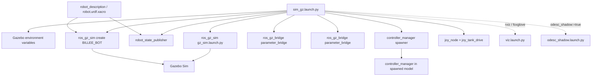
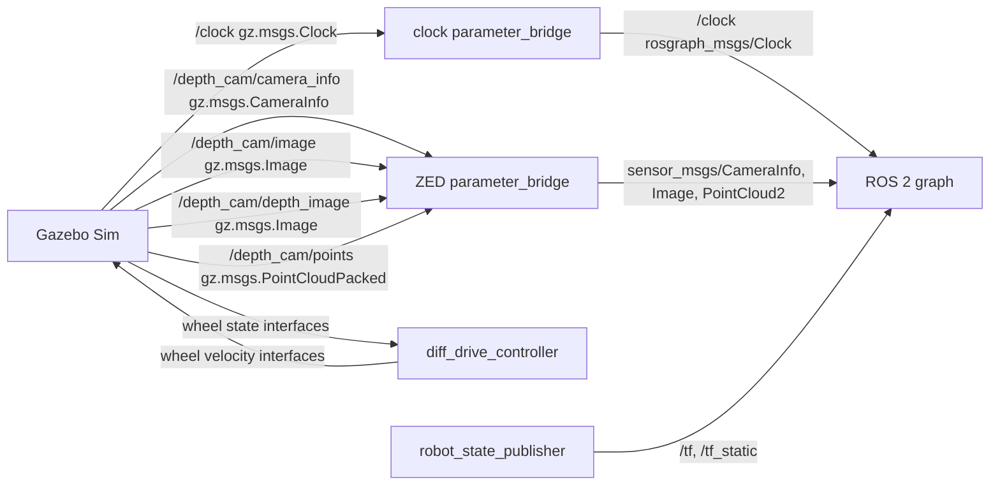

# chassis_bringup

## 1. How This Package Works

`chassis_bringup` is the drivetrain bring-up package for the BILLEE chassis. It owns the launch files that pick a `ros2_control` backend (Gazebo, real ODESC over CAN, or a no-hardware loopback), the viewers (RViz2, Foxglove), and the one-command rover / ground-station entry points.

| Launch file | Role | Key arguments (default) |
|---|---|---|
| `rover.launch.py` | **Rover entry point.** Includes `sim_gz` or `real` and always starts the Foxglove bridge on :8765. | `mode` (`sim` \| `real`), `rviz` (`false`), `can_interface` (`can0`), `gear_ratio` (`48.0`) — last two `mode:=real` only |
| `ground_station.launch.py` | **Ground-station entry point.** `viz` + teleop (`joy_node` → `joy_tank_drive`), optionally opens the F' GDS web UI. | `use_sim_time` (`true`), `rviz` (`true`), `foxglove` (`true`), `joystick` (`true`), `fprime_gds` (`false`), `fprime_gds_url` (`$FPRIME_GDS_URL`) |
| `sim_gz.launch.py` | Gazebo Fortress backend: Gazebo + `ign_ros2_control`, bridges, spawn, controllers, joystick teleop. Detailed below. | `x`/`y`/`z`/`yaw`, `rviz` (`false`), `foxglove` (`false`), `joy_control` (`true`), `odesc_shadow` (`false`) |
| `real.launch.py` | Real-hardware backend: standalone `ros2_control_node` + `odesc/OdescSystemHardware` (URDF `use_sim:=false`). Writes a temp `controllers.yaml` with `use_sim_time: false`. | `can_interface` (`can0`; `vcan0`, or `mock`/`none` for loopback), `gear_ratio` (`48.0`), `rviz`, `foxglove` (`false`) |
| `odesc_shadow.launch.py` | Sim add-on (`sim_gz ... odesc_shadow:=true`): a second, `/odesc_shadow`-namespaced controller manager on the ODESC plugin + `odesc_vcan_emulator.py`, fed the same `cmd_vel` as Gazebo. Exercises CAN framing while Gazebo stays the physics/TF source. | `can_interface` (`vcan0`) — needs `tooling/can-up vcan0` |
| `viz.launch.py` | RViz2 (`rviz/drivetrain.rviz`) and/or `foxglove_bridge` (:8765, `0.0.0.0`). Included by all of the above. | `rviz` (`true`), `foxglove` (`true`), `use_sim_time` (`false`), `rviz_config` |

`diff_drive_controller` and `joint_state_broadcaster` (config in `robot_description/config/controllers.yaml`) are identical across backends, so `/diff_drive_controller/cmd_vel_unstamped`, `/diff_drive_controller/odom`, `/joint_states` and TF look the same in sim and on hardware. See `docs/RUN_GUIDE.md` for the full step-by-step.

The rest of this document covers the simulator backend. `launch/sim_gz.launch.py` expands `robot_description/urdf/robot.urdf.xacro`, starts Gazebo through `ros_gz_sim`, starts a robot-state publisher and two Gazebo-to-ROS bridges, spawns the rover as `BILLEE_BOT`, asks the controller manager to activate the differential-drive and joint-state controllers, and (by default) starts joystick teleop.

The launch is designed for simulation time. It provides the expanded XML to `robot_state_publisher` as its `robot_description` parameter and passes the same description to `ros_gz_sim create` to insert the rover into Gazebo. The model itself loads `ign_ros2_control`, which reads the controller configuration supplied by `robot_description`.

The bridges are deliberately data-driven: `config/config.yaml` currently bridges only `/clock`; `config/zed_config.yaml` bridges four Gazebo camera streams from `/depth_cam` into ROS 2. Drive commands and odometry do not go through the Gazebo bridge: `diff_drive_controller` runs inside `ign_ros2_control` and talks to the wheel joints directly. Joystick teleop (`joy_node` + the `teleop` package's `joy_tank_drive`, parameters in `config/tele_params.yaml`) is started by `sim_gz.launch.py` and publishes to `/diff_drive_controller/cmd_vel_unstamped`.

Viewer configs live alongside: `rviz/drivetrain.rviz` for RViz2 and `foxglove/drivetrain.json` for Foxglove Studio (import via Layouts → Import from file). Both show the same content — grid, TF, robot model from `/robot_description`, and the `/diff_drive_controller/odom` trail, fixed frame `odom` — and are loaded by `launch/viz.launch.py` (`rviz:=` / `foxglove:=`).

## 2. Technologies Behind It

- **ROS distro:** ROS 2 Humble.
- **Language(s) / core libraries:** Python ROS 2 Launch (`launch`, `launch_ros`, `ament_index_python`), Xacro command substitution, and ROS parameters.
- **External dependencies:** `ros_gz_sim`, `ros_gz_bridge`, `robot_state_publisher`, `controller_manager`, `ros2_controllers`, `ign_ros2_control` / `gz_ros2_control`, and Gazebo / Ignition Gazebo 6.
- **Build system / target platform(s):** `ament_cmake`, installed with `colcon`; the workspace uses Pixi for the Humble/Gazebo dependency set.
- **Middleware / networking notes:** `ros_gz_bridge` converts between Gazebo Transport and ROS 2. The configured bridge directions are all Gazebo-to-ROS; no DDS vendor or remote bridge is set here.

## 3. How It Was Written

The launch uses an `OpaqueFunction` because it must evaluate launch substitutions before constructing the string passed as Gazebo arguments and before choosing the optional includes. It resolves package-share and package-prefix paths through the ament index instead of assuming an installed location for the robot description and control plugin.

Gazebo resource, model, system-plugin, GUI-plugin, and QML import environment variables are set before Gazebo starts. This is important because the BILLEE model resolves meshes with `package://robot_description/...` and its simulator control plugin is provided by the activated Pixi/ROS environment rather than by this package.

The launch separates model state, simulator creation, and transport bridging into independent processes. That makes the Xacro model authoritative for both ROS transforms and Gazebo physics, while YAML files hold topic mapping choices. The controller spawner requests `diff_drive_controller` and `joint_state_broadcaster` together, relying on the plugin embedded in the spawned robot model to create the controller manager.

There are no package-specific unit or launch tests. Validate with a full simulator launch and ROS CLI checks. Two current implementation details are worth preserving: `world_file` is declared but ignored because `gz_args` is hard-coded to `empty.sdf`, and `joy_control` is evaluated as a Python truthiness check on a `LaunchConfiguration` object, so `joy_control:=false` does not currently disable teleop.

The Ignition GUI plugin / QML directory is discovered at launch time from the active environment prefix (`$CONDA_PREFIX`, else `sys.prefix`) by globbing `lib/ign-gazebo-*/plugins/gui`, so the launch works from any checkout location and any Pixi environment; the two GUI variables are skipped when no directory is found (e.g. headless under `xvfb-run`).

## 4. Architecture

### 4a. Launch composition



### 4b. Topic / interface graph



There is no `/cmd_vel` or `/odom` bridge edge by design: `diff_drive_controller` subscribes to `/diff_drive_controller/cmd_vel_unstamped` and publishes `/diff_drive_controller/odom` (plus `odom → base_link` TF) from inside the controller manager hosted by Gazebo.

## 5. How to Run It

### Prerequisites

- Set up the machine once from the repo root with `make setup <mac|linux-aarch64|l4t>` (see the top-level `README.md` → *Setup*), or open the matching devcontainer. This installs the Pixi environment (ROS 2 Humble, Gazebo Fortress, `ros_gz`, `ros2_control`, `foxglove_bridge`) and builds the workspace.
- Every command below runs from `ros2_ws` through Pixi. Pick the environment for your machine:

  | Machine | `-e` / `--environment` |
  |---|---|
  | x86-64 + NVIDIA (default devcontainer) | `default` (may be omitted) |
  | Apple-Silicon Mac container | `mac-cpu` |
  | Native ARM64 Linux | `linux-aarch64` |
  | Jetson rover | `l4t` |

  `pixi run` activates the environment, sources `install/setup.sh` and sets `ROS_DOMAIN_ID=42`; a plain shell must do both itself.
- Gazebo needs a display. On a headless machine (Mac container, rover over SSH) wrap sim launches in `xvfb-run -a` and view through Foxglove at `ws://<host>:8765`.
- `robot_description` must be built alongside `chassis_bringup`; `pixi run -e <env> build` builds the whole workspace.
- Optional, for `odesc_shadow:=true` / `can_interface:=vcan0`: `tooling/can-up vcan0` on the **host** (needs `kmod` + `can-utils`, installed by `make setup` on Linux).

### Build

```bash
cd ros2_ws
pixi run -e <env> build
```

### Launch

The usual entry points (see §1 for every argument):

```bash
cd ros2_ws
# Sim rover + Foxglove bridge (:8765). Add `xvfb-run -a` in front when headless.
pixi run -e <env> ros2 launch chassis_bringup rover.launch.py
# Real ODESC drivetrain (bring up can0 first), or no motors with can_interface:=mock
pixi run -e <env> ros2 launch chassis_bringup rover.launch.py mode:=real can_interface:=mock
# Ground station: RViz + Foxglove bridge + joystick teleop
pixi run -e <env> ros2 launch chassis_bringup ground_station.launch.py
```

To run just the simulator backend:

```bash
pixi run -e <env> ros2 launch chassis_bringup sim_gz.launch.py \
  description_pkg:=robot_description \
  xacro_file:=urdf/robot.urdf.xacro \
  x:=0.0 y:=0.0 z:=0.2 yaw:=0.0 \
  rviz:=true foxglove:=true
```

`world_file` is accepted as an argument but does not currently change the launched world; the launch passes `empty.sdf` to Gazebo unconditionally.

Without a gamepad (e.g. the Mac container), drive from the keyboard in its own terminal:

```bash
pixi run -e <env> ros2 run teleop_twist_keyboard teleop_twist_keyboard \
  --ros-args -r /cmd_vel:=/diff_drive_controller/cmd_vel_unstamped
```

With a gamepad, hold the right bumper (RB, deadman), then right trigger = forward, left trigger = reverse, left stick = steer. Remap in `config/tele_params.yaml` (keep it in sync with `teleop/config/joystick.yaml`).

### Verify it's running

- Gazebo should contain an entity named `BILLEE_BOT`.
- `ros2 topic echo --once /clock` should return a `rosgraph_msgs/msg/Clock` message.
- `ros2 topic echo --once /depth_cam/camera_info` should return a `sensor_msgs/msg/CameraInfo` message when the camera is rendering.
- `ros2 node list` should include `/robot_state_publisher` and two `parameter_bridge` processes (their exact names depend on ROS node-name resolution).
- `ros2 control list_controllers` should report the requested `diff_drive_controller` and `joint_state_broadcaster` once the control plugin is initialized.
- `ros2 topic echo --once /diff_drive_controller/odom` should return a `nav_msgs/msg/Odometry` message.

(Prefix each with `pixi run -e <env>` from `ros2_ws`.)

### Common issues

- **Missing meshes, rendering resources, or `ign_ros2_control` plugin:** ensure the Pixi environment is active and run the provided launch rather than `gz sim` directly; the launch sets the required resource/plugin paths.
- **Gazebo GUI side panels missing:** the GUI plugin directory is discovered from the active environment prefix. Launch through `pixi run -e <env>` (or inside `pixi shell -e <env>`) so `$CONDA_PREFIX` points at the right env.
- **Gazebo fails to open a window / GL errors on a CPU-only machine:** run under `xvfb-run -a` and view in Foxglove; the Mac container also sets `LIBGL_ALWAYS_SOFTWARE=1` / `GALLIUM_DRIVER=llvmpipe`.
- **Rover doesn't move:** commands must reach `/diff_drive_controller/cmd_vel_unstamped` (the teleop nodes remap `/cmd_vel` to it) and `ros2 control list_controllers` must show `diff_drive_controller` active. With a gamepad, the deadman button must be held.
- **`joy_control:=false` still starts teleop:** known launch-file bug (see §3). Without a gamepad the `joy_node` just logs that it can't open the device; it is harmless.
- **`world_file:=...` has no effect:** this is a known launch-file limitation; change the `gz_args` construction to use `world_path`.
- **`odesc_shadow:=true` fails to open the CAN socket:** `vcan0` doesn't exist; run `tooling/can-up vcan0` on the host first.

## 6. Subnode Breakdown

### Gazebo Sim (`gz_sim.launch.py` include)

- **Package:** `ros_gz_sim`
- **Purpose:** Starts Gazebo in run mode with verbosity 4 and an empty world; owns the Gazebo Transport graph and the spawned rover.
- **Publishes:** Gazebo `/clock` and the Gazebo-side `/depth_cam/*` sensor topics consumed by the bridge configuration.
- **Subscribes:** Gazebo model/plugin interfaces; no ROS 2 topic interface is declared by this launch include.
- **Services / Actions:** Gazebo services are implementation-provided; none are declared by `chassis_bringup`.
- **Parameters:** `publish_rate: 400.0` is passed under the `gazebo` node from `config/gz_params.yaml`.
- **Depends on:** Gazebo assets and plugins found through the launch-set environment variables.

### `robot_state_publisher`

- **Package:** `robot_state_publisher`
- **Purpose:** Publishes the BILLEE kinematic transform tree from the Xacro-expanded `robot_description`.
- **Publishes:**

  | Topic | Type | Description |
  |---|---|---|
  | `/tf` | `tf2_msgs/msg/TFMessage` | Dynamic transforms when joint states are available. |
  | `/tf_static` | `tf2_msgs/msg/TFMessage` | Fixed chassis, suspension, and camera transforms. |

- **Subscribes:** `/joint_states` (`sensor_msgs/msg/JointState`) when the joint-state broadcaster is active.
- **Services / Actions:** Parameter services supplied by ROS 2; no custom service/action is declared.
- **Parameters:**

  | Name | Default / launch value | Description |
  |---|---|---|
  | `robot_description` | Xacro expansion of `robot.urdf.xacro` | Rover model XML. |
  | `use_sim_time` | `true` | Uses the bridged simulation clock. |

- **Depends on:** `robot_description` assets; `/joint_states` for moving wheel transforms.

### Clock bridge (`parameter_bridge`)

- **Package:** `ros_gz_bridge`
- **Purpose:** Converts Gazebo simulation time into ROS 2 simulation time.
- **Publishes:**

  | Topic | Type | Description |
  |---|---|---|
  | `/clock` | `rosgraph_msgs/msg/Clock` | ROS 2 simulation clock converted from `gz.msgs.Clock`. |

- **Subscribes:** Gazebo `/clock` (`gz.msgs.Clock`).
- **Services / Actions:** None configured.
- **Parameters:** `config_file` points to `config/config.yaml`.
- **Depends on:** Gazebo Sim being active.

### ZED bridge (`parameter_bridge`)

- **Package:** `ros_gz_bridge`
- **Purpose:** Converts the robot model’s Gazebo RGB-D camera streams into ROS 2 messages.
- **Publishes:**

  | Topic | Type | Description |
  |---|---|---|
  | `/depth_cam/camera_info` | `sensor_msgs/msg/CameraInfo` | Camera calibration and metadata. |
  | `/depth_cam/image` | `sensor_msgs/msg/Image` | Simulated image stream. |
  | `/depth_cam/depth_image` | `sensor_msgs/msg/Image` | Simulated depth image. |
  | `/depth_cam/points` | `sensor_msgs/msg/PointCloud2` | Simulated point cloud. |

- **Subscribes:** The matching Gazebo topics (`gz.msgs.CameraInfo`, `gz.msgs.Image`, and `gz.msgs.PointCloudPacked`).
- **Services / Actions:** None configured.
- **Parameters:** `config_file` points to `config/zed_config.yaml`.
- **Depends on:** The `zed2i` Gazebo sensor embedded in `robot_description` and the Gazebo Sensors system plugin.

### Rover spawn client (`create`)

- **Package:** `ros_gz_sim`
- **Purpose:** Inserts the Xacro-expanded rover into Gazebo as entity `BILLEE_BOT`.
- **Publishes:** None.
- **Subscribes:** Reads the ROS parameter/topic source named `robot_description` through its `-topic robot_description` argument.
- **Services / Actions:** Calls the Gazebo entity-creation service internally; no custom ROS service/action is declared by this package.
- **Parameters:** None. Launch arguments provide entity name and pose: `x`, `y`, `z`, and `yaw`.
- **Depends on:** Gazebo Sim and a valid expanded robot description.

### Controller spawner (`spawner`)

- **Package:** `controller_manager`
- **Purpose:** Requests activation of `diff_drive_controller` and `joint_state_broadcaster`, which are declared in `robot_description/config/controllers.yaml` and instantiated by the model’s `ign_ros2_control` plugin.
- **Publishes:** None directly; activated controllers expose the motion and joint-state interfaces.
- **Subscribes:** None directly.
- **Services / Actions:** Calls controller-manager services to load/configure/activate the named controllers.
- **Parameters:** Controller names are positional launch arguments: `diff_drive_controller`, `joint_state_broadcaster`.
- **Depends on:** A spawned BILLEE model whose `ign_ros2_control` plugin has created a controller manager.

### Teleop (`joy_node` + `joy_tank_drive`)

- **Package:** `joy`, `teleop`
- **Purpose:** Reads the gamepad and turns it into an arcade-drive `Twist`: triggers for throttle (RT forward, LT reverse), left stick for steering, gated by the RB deadman.
- **Publishes:** `/joy` (`sensor_msgs/msg/Joy`); `/diff_drive_controller/cmd_vel_unstamped` (`geometry_msgs/msg/Twist`, remapped from `/cmd_vel`).
- **Subscribes:** `/joy` (`joy_tank_drive`).
- **Parameters:** `config/tele_params.yaml` — `device_id`, `deadzone`, `autorepeat_rate` (`joy_node`); `deadman_button`, `steer_axis`, `steer_scale`, `invert_steer`, `throttle_axis`, `reverse_axis`, `speed_scale`, `trigger_rest`, `trigger_press` (`joy_tank_drive`).
- **Depends on:** a gamepad at `/dev/input/js<device_id>`; started unconditionally today (see §3).

### Optional includes

- **`viz.launch.py`** — added when `rviz:=true` and/or `foxglove:=true`, with `use_sim_time:=true`.
- **`odesc_shadow.launch.py`** — added when `odesc_shadow:=true`, always on `vcan0`.
