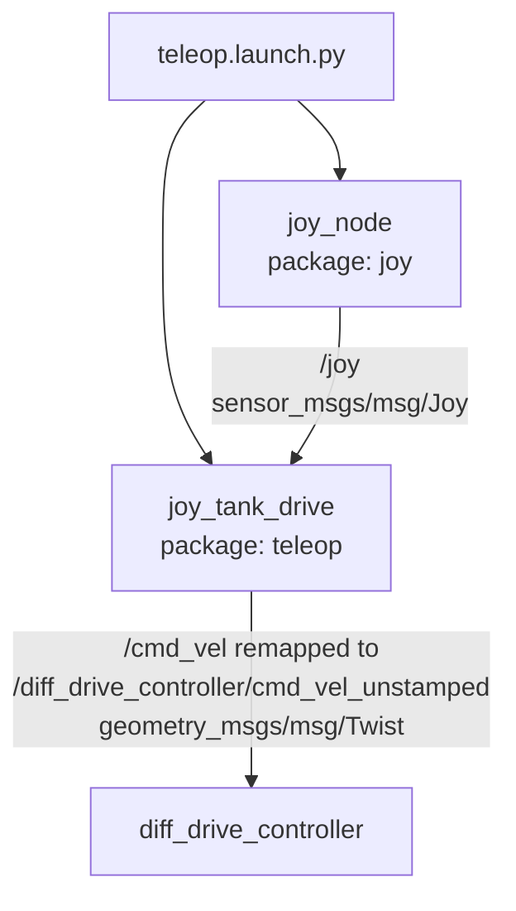
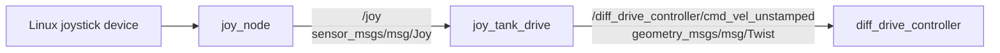

# teleop / joy_tank_drive

## 1. How This Node Works

The `teleop` package converts a Linux joystick into differential-drive velocity commands for the rover. Its standalone launch file starts two nodes: ROS 2's `joy_node`, which reads the joystick device and publishes `sensor_msgs/msg/Joy` on `/joy`, and this package's `joy_tank_drive` node, which converts that input to `geometry_msgs/msg/Twist`.

`joy_tank_drive` uses a tank-drive scheme. It reads one axis for the left track and one for the right track, averages them for forward/reverse velocity, and uses their difference plus the configured track width for yaw rate. With the default checked-in configuration, the node reads `/joy.axes[1]` as the left command and `/joy.axes[4]` as the right command. It calculates:

```text
linear.x  = ((left + right) / 2) * max_vel
angular.z = ((right - left) / track_width) * max_vel
```

Motion is gated by `safety_button` (button `5` by default). Holding it publishes the calculated command; releasing it publishes a zero-initialized `Twist`, stopping the rover on the next joystick update. The node publishes one command per incoming `/joy` message. The supplied `joy_node` configuration sets `autorepeat_rate` to 20 Hz, so the latest joystick state is republished while the controller remains connected.

The launch file remaps the node's `/cmd_vel` output to `/diff_drive_controller/cmd_vel_unstamped`, the unstamped command input of the workspace's `diff_drive_controller`. The Gazebo bring-up can start this same pair with `joy_control:=true`; the ground-station launch includes the package's standalone launch by default.

## 2. Technologies Behind It

- **ROS distro:** ROS 2 Humble (the workspace Pixi manifest declares Humble packages).
- **Language(s) / core libraries:** C++ and `rclcpp`; `sensor_msgs/msg/Joy` input and `geometry_msgs/msg/Twist` output.
- **External dependencies:** The ROS 2 `joy` package and a joystick available to Linux, normally as a `/dev/input/js*` device.
- **Build system / target platform(s):** `ament_cmake` and `colcon`, run through the repository's Pixi environment where applicable. The node is portable ROS 2 C++ and commands the rover's `diff_drive_controller`.
- **Middleware / networking notes:** Default ROS 2 settings with depth-1 publisher and subscription queues. The package has no custom DDS, bridge, or network configuration; DDS carries its command when teleop runs on a ground station.

## 3. How It Was Written

The design separates generic joystick handling from rover-specific drive mixing. `joy_node` owns Linux device access, deadzone processing, and autorepeat. `JoyTankDrive` in [`src/joy_teleop.cpp`](src/joy_teleop.cpp) receives the normalized axes and applies the differential-drive mixing. This keeps controller selection and tuning in [`config/joystick.yaml`](config/joystick.yaml), without changing or rebuilding the node.

`JoyTankDrive::topic_callback` starts every message with a zero `Twist`. When the safety button is pressed, it fills only `linear.x` and `angular.z`; all other fields remain zero. `max_vel` scales both the linear and angular results, while `track_width` controls the turn-rate calculation. This direct event-driven approach avoids a second timer and ensures that releasing the safety button results in a zero command on the next `Joy` message.

There are no package-specific unit or hardware-in-the-loop tests. The callback currently indexes `msg.axes` and `msg.buttons` directly, so invalid `left_axis`, `right_axis`, or `safety_button` values can cause an out-of-range access. Confirm mappings with `/joy` before operating the drivetrain, and keep drive power disabled or the rover safely supported while tuning a new controller.

## 4. Architecture

### 4a. Node composition



### 4b. Topic / interface graph



## 5. How to Run It

### Prerequisites

- A built ROS 2 Humble workspace, or the repository's Pixi environment.
- A joystick recognized by the host. The checked-in configuration opens `device_id: 0`.
- A running `diff_drive_controller` subscribed to `/diff_drive_controller/cmd_vel_unstamped` if motion is required.
- The rover safely supported or drive power disabled while checking a controller's axis and button mapping.

### Build

From the ROS workspace:

```bash
cd ros2_ws
pixi run colcon build --packages-select teleop
source install/setup.bash
```

With a separately installed Humble environment, source Humble first and run the equivalent `colcon build --packages-select teleop` command.

### Launch

Start teleop by itself:

```bash
cd ros2_ws
source install/setup.bash
ros2 launch teleop teleop.launch.py
```

For the integrated simulation, use the chassis bring-up launch with joystick control enabled (its default):

```bash
ros2 launch chassis_bringup sim_gz.launch.py joy_control:=true
```

The ground-station launch also includes `teleop.launch.py` unless `joystick:=false` is supplied:

```bash
ros2 launch chassis_bringup ground_station.launch.py
```

### Verify it's running

1. Confirm the nodes are present:

   ```bash
   ros2 node list
   ```

   Expected entries include `/joy_node` and `/joy_tank_drive`.

2. Identify the controller's actual axis and button indices before changing the YAML:

   ```bash
   ros2 topic echo /joy
   ```

3. Hold safety button `5`, move the configured left and right axes, and inspect the command:

   ```bash
   ros2 topic echo /diff_drive_controller/cmd_vel_unstamped
   ```

   When the safety button is released, the next command is all zeros. When held, equal left/right values produce linear motion; different values produce a non-zero `angular.z`.

### Common issues

- **No `/joy` messages:** confirm the controller is connected to the host and change `joy_node.ros__parameters.device_id` if it is not device `0`.
- **No motion command:** hold safety button `5`, or set `safety_button` under `joy_tank_drive.ros__parameters` to the correct button index. It is not explicitly set in the checked-in YAML, so the node default of `5` applies.
- **Incorrect forward direction or turning:** inspect `/joy`, then change `left_axis` and `right_axis` to match the physical controls. Axis signs come directly from the joystick driver; reverse an axis in the controller configuration if needed.
- **Node exits or crashes on input:** verify that both configured axis indices and `safety_button` exist in the received `Joy` message. The current implementation does not bounds-check them.
- **Commands appear but the rover does not move:** ensure `diff_drive_controller` is active and listening on `/diff_drive_controller/cmd_vel_unstamped`.

## 6. Subnode Breakdown

### `joy_node`

- **Package:** `joy`
- **Purpose:** Opens the Linux joystick device, preprocesses its state, and publishes ROS 2 joystick messages.
- **Publishes:**

  | Topic | Type | Description |
  |---|---|---|
  | `/joy` | `sensor_msgs/msg/Joy` | Joystick axis values and button states. |

- **Subscribes:** None declared by this package launch.
- **Services / Actions:** No services or actions are declared by this package launch.
- **Parameters:**

  | Name | Launch value | Description |
  |---|---:|---|
  | `device_id` | `0` | Linux joystick-device index to open. |
  | `deadzone` | `0.05` | Input magnitude treated as centered. |
  | `autorepeat_rate` | `20.0` | Rate in Hz for republishing the latest joystick state. |

- **Depends on:** A joystick device visible to the host operating system.

### `joy_tank_drive`

- **Package:** `teleop`
- **Purpose:** Converts separate left and right joystick axes to a deadman-gated differential-drive velocity command.
- **Publishes:**

  | Topic | Type | Description |
  |---|---|---|
  | `/cmd_vel` (remapped to `/diff_drive_controller/cmd_vel_unstamped`) | `geometry_msgs/msg/Twist` | Tank-drive command: `linear.x` is average track speed; `angular.z` is the scaled track-speed difference. |

- **Subscribes:**

  | Topic | Type | Description |
  |---|---|---|
  | `/joy` | `sensor_msgs/msg/Joy` | Joystick axes and buttons from `joy_node`. |

- **Services / Actions:** No custom services or actions.
- **Parameters:**

  | Name | Code default | Launch value | Description |
  |---|---:|---:|---|
  | `left_axis` | `0` | `1` | Axis used as the left-track command. |
  | `right_axis` | `2` | `4` | Axis used as the right-track command. |
  | `safety_button` | `5` | `5` (default) | Button that must be held before non-zero motion is sent. |
  | `max_vel` | `0.0` | `2.0` | Multiplier applied to both linear and angular output. |
  | `track_width` | `0.67` | `0.67` | Divisor in the yaw-rate calculation; intended rover track width. |

- **Depends on:** `joy_node` publishing a `Joy` message with all configured indices, plus a consumer such as `diff_drive_controller` subscribed to the remapped command topic.
