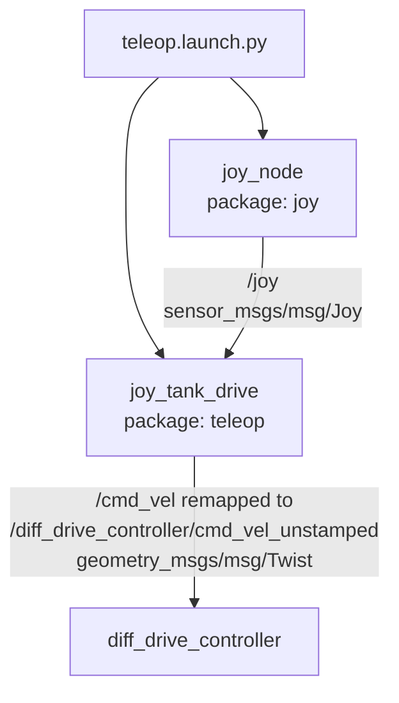
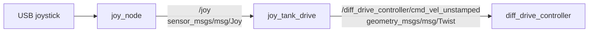

# teleop / joy_tank_drive

## 1. How This Node Works

The `teleop` package turns a USB joystick into rover drive commands. Its launch file starts the ROS 2 `joy` driver, which reads the selected Linux joystick device and publishes `sensor_msgs/msg/Joy` messages on `/joy`. It also starts this package's `joy_tank_drive` executable, named `joy_tank_drive` at launch.

`joy_tank_drive` (name is historical — the scheme is arcade, not tank) reads the left stick X axis for steering and the two analog triggers for throttle: right trigger forward, left trigger reverse. While the configured deadman button is held it publishes `linear.x = (forward − reverse) · speed_scale` and `angular.z = steer · steer_scale`; it publishes a `geometry_msgs/msg/Twist` for every received joystick message, and an all-zero one whenever the deadman is not held. The launch remaps its `/cmd_vel` output to `/diff_drive_controller/cmd_vel_unstamped`, the unstamped velocity input expected by the workspace's diff-drive controller.

The package is event-driven: joystick messages trigger the conversion immediately, rather than a timer continuously republishing a command. The supplied `joy` configuration enables a 20 Hz autorepeat rate, so a connected joystick continues to deliver its most recent state and therefore continues to refresh a held command.

## 2. Technologies Behind It

- **ROS distro:** ROS 2 Humble, as configured by `ros2_ws/pixi.toml`.
- **Language(s) / core libraries:** C++ with `rclcpp`; `sensor_msgs/msg/Joy` input and `geometry_msgs/msg/Twist` output.
- **External dependencies:** The ROS 2 `joy` package and a joystick exposed by Linux (normally under `/dev/input`). No vendor SDK or custom hardware driver is used here.
- **Build system / target platform(s):** `ament_cmake` and `colcon`; this repository provides a Pixi environment for the ROS desktop workspace. The node is portable ROS 2 C++ and is intended to command the rover's `diff_drive_controller`.
- **Middleware / networking notes:** The code uses default ROS 2 communication settings with depth-1 queues for both `/joy` and `/cmd_vel`. It has no bridge, DDS-vendor, or network-specific configuration.

## 3. How It Was Written

The package keeps joystick hardware access and rover-specific drive mixing separate. `joy_node` is responsible for device selection, deadzone handling, and message publication; `JoyTankDrive` in [`src/joy_teleop.cpp`](src/joy_teleop.cpp) only maps the generic `Joy` message to a rover velocity command. This lets joystick tuning remain in [`config/joystick.yaml`](config/joystick.yaml) while retaining a small custom control node.

The conversion in `JoyTankDrive::onJoy` maps a trigger axis to a `0..1` press amount
(`(trigger_rest − v) / (trigger_rest − trigger_press)`, clamped; treated as `0` until the
axis first reports a non-zero value, since some drivers report `0.0` for an untouched
trigger) and mixes `linear.x = (forward − reverse) · speed_scale`,
`angular.z = (invert_steer ? −1 : 1) · axes[steer_axis] · steer_scale`. Holding the deadman
button gates both; releasing it publishes a zero `Twist`. All configured indices are
range-checked against the incoming `Joy` message — an out-of-range index logs a throttled
warning and publishes zeros instead of crashing.

No package-specific unit tests or hardware-in-the-loop tests are defined in the source. Validate changes with a connected controller by inspecting `/joy` and `/diff_drive_controller/cmd_vel_unstamped` before enabling the rover drivetrain.

## 4. Architecture

### 4a. Node composition



### 4b. Topic / interface graph



## 5. How to Run It

### Prerequisites

- A ROS 2 Humble environment or the repository's Pixi environment.
- A joystick recognized by the host operating system. The supplied configuration selects `device_id: 0`.
- A running `diff_drive_controller` that accepts unstamped velocity commands on `/diff_drive_controller/cmd_vel_unstamped` if rover motion is required.
- Keep the rover safely supported or its drive power disabled while checking the mappings for a new controller.

### Build

From the ROS workspace:

```bash
cd ros2_ws
pixi run colcon build --packages-select teleop
source install/setup.bash
```

If using a separately installed ROS 2 Humble environment, run the equivalent `colcon build --packages-select teleop` after sourcing the Humble setup script.

### Launch

```bash
cd ros2_ws
source install/setup.bash
ros2 launch teleop teleop.launch.py
```

The launch reads `config/joystick.yaml`. The checked-in mapping is joystick device `0`, deadzone `0.05`, autorepeat rate `20.0 Hz`, `deadman_button 5` (RB / R1), `steer_axis 0` (left stick X), `throttle_axis 5` (RT / R2), `reverse_axis 2` (LT / L2), `steer_scale 1.5`, `speed_scale 2.0`. These indices are the same for Xbox and PlayStation pads via `joy_node`.

### Verify it's running

1. Confirm both processes are present:

   ```bash
   ros2 node list
   ```

   Expected entries include `/joy_node` and `/joy_tank_drive`.

2. Move the sticks and inspect the raw input:

   ```bash
   ros2 topic echo /joy
   ```

3. In another terminal, hold the deadman (RB / R1, button `5`) and verify the generated command:

   ```bash
   ros2 topic echo /diff_drive_controller/cmd_vel_unstamped
   ```

   With the deadman released, each published `Twist` should contain zero velocity. With it held, pulling RT/R2 gives `linear.x > 0`, LT/L2 gives `linear.x < 0`, and the left stick sets `angular.z`.

### Common issues

- **No `/joy` messages:** make sure the joystick is connected, is visible to the host, and is the device selected by `device_id: 0`; choose a different `device_id` in `config/joystick.yaml` when needed.
- **No drive command while moving the sticks:** hold the deadman (button `5`), or set the correct `deadman_button` index for your pad in `config/joystick.yaml`.
- **Trigger does nothing until pulled once:** expected — `joy_node` reports `0.0` for an untouched trigger; the node treats that as released until the first real reading.
- **Unexpected steering or speed:** inspect `/joy`, then update `steer_axis` / `throttle_axis` / `reverse_axis` / `invert_steer` / the `*_scale` values to match the physical controller.
- **Commands appear but the rover does not move:** start and configure the `diff_drive_controller`; its command topic must be `/diff_drive_controller/cmd_vel_unstamped`. For the repository's current Gazebo launch, a velocity bridge is still required.

## 6. Subnode Breakdown

### `joy_node`

- **Package:** `joy`
- **Purpose:** Reads the configured Linux joystick device, applies input preprocessing, and emits ROS 2 joystick messages.
- **Publishes:**

  | Topic | Type | Description |
  |---|---|---|
  | `/joy` | `sensor_msgs/msg/Joy` | Axis values and button states from the joystick. |

- **Subscribes:** None declared by this launch.
- **Services / Actions:** No services or actions are declared by this package's launch.
- **Parameters:**

  | Name | Launch value | Description |
  |---|---:|---|
  | `device_id` | `0` | Linux joystick device index to open. |
  | `deadzone` | `0.05` | Input magnitude treated as centered. |
  | `autorepeat_rate` | `20.0` | Rate in Hz for republishing the latest joystick state. |

- **Depends on:** A joystick device available to the operating system.

### `joy_tank_drive`

- **Package:** `teleop`
- **Purpose:** Converts left-stick steering + analog triggers to a deadman-gated velocity command.
- **Publishes:**

  | Topic | Type | Description |
  |---|---|---|
  | `/cmd_vel` (remapped to `/diff_drive_controller/cmd_vel_unstamped`) | `geometry_msgs/msg/Twist` | Forward/reverse command in `linear.x` and turn command in `angular.z`. |

- **Subscribes:**

  | Topic | Type | Description |
  |---|---|---|
  | `/joy` | `sensor_msgs/msg/Joy` | Raw axes and button state from `joy_node`. |

- **Services / Actions:** No custom services or actions.
- **Parameters:**

  | Name | Code default | Launch value | Description |
  |---|---:|---:|---|
  | `deadman_button` | `5` | `5` | Button (RB / R1) that must be held to send motion. |
  | `steer_axis` | `0` | `0` | Left stick X axis for steering. |
  | `steer_scale` | `1.5` | `1.5` | `angular.z` (rad/s) at full stick. |
  | `invert_steer` | `false` | `false` | Negate steering if the pad reports stick-right as `+1`. |
  | `throttle_axis` | `5` | `5` | Forward trigger axis (RT / R2). |
  | `reverse_axis` | `2` | `2` | Reverse trigger axis (LT / L2). |
  | `speed_scale` | `2.0` | `2.0` | `linear.x` (m/s) at full trigger. |
  | `trigger_rest` | `1.0` | `1.0` | `/joy` axis value with a trigger released. |
  | `trigger_press` | `-1.0` | `-1.0` | `/joy` axis value with a trigger fully pressed. |

- **Depends on:** `joy_node` publishing valid `/joy` messages and a consumer, typically `diff_drive_controller`, subscribed to the remapped command topic.
