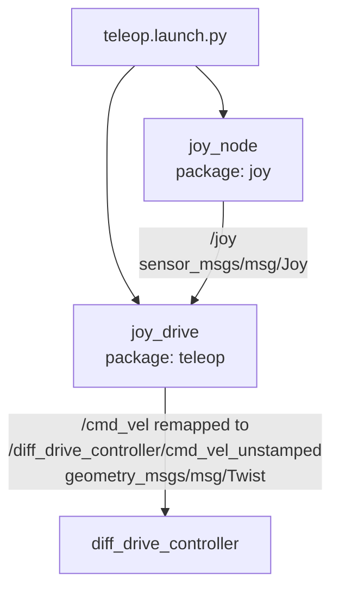
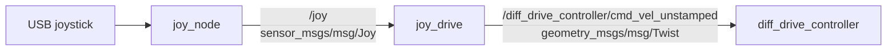

# teleop / joy_drive

## 1. How This Node Works

The `teleop` package turns a USB joystick into rover drive commands. Its launch file starts the ROS 2 `joy` driver, which reads the selected Linux joystick device and publishes `sensor_msgs/msg/Joy` messages on `/joy`. It also starts this package's `joy_drive` executable, named `joy_drive` at launch.

`joy_drive` runs one of two control schemes, chosen by the `scheme` parameter in [`config/joystick.yaml`](config/joystick.yaml). **Arcade is the scheme the team drives; tank is selectable but has never been run on hardware** (see [Tank is unvalidated](#tank-is-unvalidated) below). Changing it never needs a rebuild, and can be done live on a running node — `ros2 param set /joy_drive scheme tank`, or the Parameters panel in the Foxglove `drivetrain.json` layout. The change applies to the next `/joy` message; an invalid value is rejected rather than silently ignored.

- **`scheme: arcade`** (default) reads the left stick X axis for steering and the two analog triggers for throttle: right trigger forward, left trigger reverse. While the deadman is held it publishes `linear.x = (forward − reverse) · speed_scale` and `angular.z = steer · steer_scale`.
- **`scheme: tank`** reads one stick per track. While the deadman is held it publishes `linear.x = (left + right)/2 · speed_scale` and `angular.z = (right − left)/track_width · speed_scale` — both sticks forward drives straight, opposite sticks spin in place. `track_width` is the real distance between the tracks in metres; measure it on the rover, because it sets how much stick difference becomes how many rad/s.

A pad can also reach this node from a browser instead of `/dev/input`, via Foxglove's
Joystick panel over the bridge — the only gamepad path on a Mac, where Docker Desktop
passes no USB through, and on WSL2, whose stock kernel has no joystick driver. Select it with `joy_source:=browser`:

```bash
ros2 launch teleop teleop.launch.py joy_source:=browser
```

That skips `joy_node` (there is no local device to open) and loads
[`config/joystick_browser.yaml`](config/joystick_browser.yaml) instead of
`joystick.yaml`, because a browser reports pads with a different mapping.
`tooling/ground-up` and `tooling/sim-up` select it automatically on the Mac and WSL2
(`JOY_SOURCE=device|browser` overrides). See
[T4b in docs/RUN_MODES.md](../../../docs/RUN_MODES.md#t4b--real-gamepad-through-the-browser)
for the mapping differences and the panel to use.

Either way it publishes a `geometry_msgs/msg/Twist` for every received joystick message, and an all-zero one whenever the deadman is not held. The launch remaps its `/cmd_vel` output to `/diff_drive_controller/cmd_vel_unstamped`, the unstamped velocity input expected by the workspace's diff-drive controller.

### Switching the scheme at runtime

`scheme` has a set-parameters callback, so it is not only a startup value — a change
applies to the **next `/joy` message**, with no relaunch. Switching mid-drive is safe:
the deadman still gates all motion, and the next message is simply mixed the new way.

```bash
ros2 param set /joy_drive scheme tank      # takes effect immediately
ros2 param get /joy_drive scheme
```

The Foxglove layout [`chassis_bringup/foxglove/drivetrain.json`](../chassis_bringup/foxglove/drivetrain.json)
includes a **Parameters** panel bound to `/joy_drive` for exactly this. Foxglove renders
it as an editable text field, not a dropdown — its Parameters panel has no enum widget —
but the valid values are published in the parameter's descriptor
(`additional_constraints: "one of: arcade, tank"`), which descriptor-aware UIs display.

An invalid value is **rejected**, not silently coerced. The node keeps its current
scheme and the call reports why, so a typo in a UI cannot quietly change how the rover
drives:

```
$ ros2 param set /joy_drive scheme banana
Setting parameter failed: scheme must be 'arcade' or 'tank', got 'banana'
```

(An invalid value in the *yaml* is different: at startup there is no caller to report
to, so the node logs a warning and falls back to arcade rather than refusing to run.)

### Silence watchdog

`onJoy()` is the only place a Twist gets published from joystick input, so if `/joy`
simply **stops** — the Foxglove tab closes, the laptop sleeps, the pad is unplugged —
this node would publish nothing at all, and the last non-zero Twist would stay the last
thing on the wire.

A 100 ms timer therefore publishes a zero Twist whenever `/joy` has been quiet for
longer than `joy_timeout` (default 0.5 s), and keeps publishing zeros until input
returns. It uses a **steady clock**, not the node clock: `ground_station.launch.py` can
run with `use_sim_time`, and a frozen `/clock` would silently disable the watchdog.

This is defence in depth, not the only guard — `diff_drive_controller` independently
halts the wheels `cmd_vel_timeout` (0.25 s) after the last command. The point is that
the ground side stops *asking*, rather than relying on the rover to stop listening. It
matters most for `joy_source:=browser`, which has no `joy_node` and therefore no
autorepeat at all.

**What it cannot catch:** a *hung* pad driver. `joy_node` republishes the last state at
`autorepeat_rate` (20 Hz), so a frozen driver holding the deadman looks exactly like a
driver genuinely holding it. Lowering `autorepeat_rate` does not help — at 0 a held
stick publishes nothing and this watchdog would zero spuriously. The check is physical:
unplug the pad mid-drive and confirm `/joy` actually stops.

Verify it:

```bash
ros2 topic pub -r 20 /joy sensor_msgs/msg/Joy \
  "{axes: [0.0,0.0,1.0,0.0,0.0,-1.0], buttons: [0,0,0,0,0,1]}"     # deadman + RT
# in another terminal:
ros2 topic echo /diff_drive_controller/cmd_vel_unstamped
# Ctrl-C the publisher — linear.x must fall to 0 within ~0.6 s and stay there.
```

### Tank is unvalidated

**Tank has never been driven on a rover.** Selecting it logs a warning at startup and on
every switch, and that warning is earned:

```
[WARN] [joy_drive]: scheme 'tank' is UNVALIDATED on hardware: its axis defaults were
  inferred, not measured, and track_width (0.670 m) is a placeholder that sets the turn
  rate. Check both against `ros2 topic echo /joy` before driving.
```

The scheme arrived in 6d5b3ce with `left_axis: 0` and `right_axis: 2`. On the Linux
`joy_node` mapping this package documents — `steer_axis 0` (left stick X),
`reverse_axis 2` (LT), `throttle_axis 5` (RT) — those are the left stick's *horizontal*
axis and the *left trigger*. Neither is a tank input; tank needs each stick's *vertical*
axis. It also defaulted `max_vel` to `0.0`, and both outputs multiplied by it, so every
Twist it published was identically zero. It cannot ever have moved a rover.

The current defaults `left_axis: 1` / `right_axis: 4` (the two sticks' vertical axes)
are **inferred from that axis map, not measured on a pad**, and `track_width: 0.67` is
inherited and unverified. Before driving tank on hardware, check the indices against
`ros2 topic echo /joy` and measure the actual track width.

The package is event-driven: joystick messages trigger the conversion immediately, rather than a timer continuously republishing a command. The supplied `joy` configuration enables a 20 Hz autorepeat rate, so a connected joystick continues to deliver its most recent state and therefore continues to refresh a held command.

## 2. Technologies Behind It

- **ROS distro:** ROS 2 Humble, as configured by `ros2_ws/pixi.toml`.
- **Language(s) / core libraries:** C++ with `rclcpp`; `sensor_msgs/msg/Joy` input and `geometry_msgs/msg/Twist` output.
- **External dependencies:** The ROS 2 `joy` package and a joystick exposed by Linux (normally under `/dev/input`). No vendor SDK or custom hardware driver is used here.
- **Build system / target platform(s):** `ament_cmake` and `colcon`; this repository provides a Pixi environment for the ROS desktop workspace. The node is portable ROS 2 C++ and is intended to command the rover's `diff_drive_controller`.
- **Middleware / networking notes:** The code uses default ROS 2 communication settings with depth-1 queues for both `/joy` and `/cmd_vel`. It has no bridge, DDS-vendor, or network-specific configuration.

## 3. How It Was Written

The package keeps joystick hardware access and rover-specific drive mixing separate. `joy_node` is responsible for device selection, deadzone handling, and message publication; `JoyDrive` in [`src/joy_teleop.cpp`](src/joy_teleop.cpp) only maps the generic `Joy` message to a rover velocity command. This lets joystick tuning remain in [`config/joystick.yaml`](config/joystick.yaml) while retaining a small custom control node.

The conversion in `JoyDrive::onJoy` maps a trigger axis to a `0..1` press amount
(`(trigger_rest − v) / (trigger_rest − trigger_press)`, clamped; treated as `0` until the
axis first reports a non-zero value, since some drivers report `0.0` for an untouched
trigger) and mixes `linear.x = (forward − reverse) · speed_scale`,
`angular.z = (invert_steer ? −1 : 1) · axes[steer_axis] · steer_scale`. Holding the deadman
button gates both; releasing it publishes a zero `Twist`. All configured indices are
range-checked against the incoming `Joy` message — an out-of-range index logs a throttled
warning and publishes zeros instead of crashing.

No package-specific unit tests or hardware-in-the-loop tests are defined in the source. Validate changes with a connected controller by inspecting `/joy` and `/diff_drive_controller/cmd_vel_unstamped` before enabling the rover drivetrain.

## 4. Architecture

### 4a. Node composition


```mermaid
graph TD
    L[teleop.launch.py] --> J[joy_node\npackage: joy]
    L --> T[joy_drive\npackage: teleop]
    J -->|/joy\nsensor_msgs/msg/Joy| T
    T -->|/cmd_vel remapped to\n/diff_drive_controller/cmd_vel_unstamped\ngeometry_msgs/msg/Twist| D[diff_drive_controller]
```

### 4b. Topic / interface graph


```mermaid
graph LR
    H[USB joystick] --> J[joy_node]
    J -->|/joy\nsensor_msgs/msg/Joy| T[joy_drive]
    T -->|/diff_drive_controller/cmd_vel_unstamped\ngeometry_msgs/msg/Twist| D[diff_drive_controller]
```

## 5. How to Run It

### Prerequisites

- A ROS 2 Humble environment or the repository's Pixi environment.
- A joystick recognized by the host operating system. The supplied configuration selects `device_id: 0`.
- A running `diff_drive_controller` that accepts unstamped velocity commands on `/diff_drive_controller/cmd_vel_unstamped` if rover motion is required.
- Keep the rover safely supported or its drive power disabled while checking the mappings for a new controller.

### Build

From the ROS workspace:

```bash
cd ros2_ws
pixi run colcon build --packages-select teleop
source install/setup.bash
```

If using a separately installed ROS 2 Humble environment, run the equivalent `colcon build --packages-select teleop` after sourcing the Humble setup script.

### Launch

```bash
cd ros2_ws
source install/setup.bash
ros2 launch teleop teleop.launch.py
```

The launch reads `config/joystick.yaml`, which is also the file `sim_gz.launch.py` uses, so there is one mapping rather than two that drift. The checked-in mapping is `scheme: arcade`, joystick device `0`, deadzone `0.05`, autorepeat rate `20.0 Hz`, `deadman_button 5` (RB / R1), `steer_axis 0` (left stick X), `throttle_axis 5` (RT / R2), `reverse_axis 2` (LT / L2), `steer_scale 1.5`, `speed_scale 2.0`; the tank set is `left_axis 1` (left stick Y), `right_axis 4` (right stick Y), `track_width 0.67`. These indices are the same for Xbox and PlayStation pads via `joy_node`.

### Verify it's running

1. Confirm both processes are present:

   ```bash
   ros2 node list
   ```

   Expected entries include `/joy_node` and `/joy_drive`.

2. Move the sticks and inspect the raw input:

   ```bash
   ros2 topic echo /joy
   ```

3. In another terminal, hold the deadman (RB / R1, button `5`) and verify the generated command:

   ```bash
   ros2 topic echo /diff_drive_controller/cmd_vel_unstamped
   ```

   With the deadman released, each published `Twist` should contain zero velocity. With it held, pulling RT/R2 gives `linear.x > 0`, LT/L2 gives `linear.x < 0`, and the left stick sets `angular.z`.

### Common issues

- **No `/joy` messages:** make sure the joystick is connected, is visible to the host, and is the device selected by `device_id: 0`; choose a different `device_id` in `config/joystick.yaml` when needed.
- **No drive command while moving the sticks:** hold the deadman (button `5`), or set the correct `deadman_button` index for your pad in `config/joystick.yaml`.
- **Trigger does nothing until pulled once:** expected — `joy_node` reports `0.0` for an untouched trigger; the node treats that as released until the first real reading.
- **Unexpected steering or speed:** inspect `/joy`, then update `steer_axis` / `throttle_axis` / `reverse_axis` / `invert_steer` / the `*_scale` values to match the physical controller.
- **Commands appear but the rover does not move:** start and configure the `diff_drive_controller`; its command topic must be `/diff_drive_controller/cmd_vel_unstamped`. `ros2 control list_controllers` should show it active (in the sim it runs inside Gazebo's `ign_ros2_control`; no velocity bridge is needed).

## 6. Subnode Breakdown

### `joy_node`

- **Package:** `joy`
- **Purpose:** Reads the configured Linux joystick device, applies input preprocessing, and emits ROS 2 joystick messages.
- **Publishes:**

  | Topic | Type | Description |
  |---|---|---|
  | `/joy` | `sensor_msgs/msg/Joy` | Axis values and button states from the joystick. |

- **Subscribes:** None declared by this launch.
- **Services / Actions:** No services or actions are declared by this package's launch.
- **Parameters:**

  | Name | Launch value | Description |
  |---|---:|---|
  | `device_id` | `0` | Linux joystick device index to open. |
  | `deadzone` | `0.05` | Input magnitude treated as centered. |
  | `autorepeat_rate` | `20.0` | Rate in Hz for republishing the latest joystick state. |

- **Depends on:** A joystick device available to the operating system.

### `joy_drive`

- **Package:** `teleop`
- **Purpose:** Converts game-pad input to a deadman-gated velocity command, using whichever control scheme the `scheme` parameter selects (`arcade` or `tank`).
- **Publishes:**

  | Topic | Type | Description |
  |---|---|---|
  | `/cmd_vel` (remapped to `/diff_drive_controller/cmd_vel_unstamped`) | `geometry_msgs/msg/Twist` | Forward/reverse command in `linear.x` and turn command in `angular.z`. |

- **Subscribes:**

  | Topic | Type | Description |
  |---|---|---|
  | `/joy` | `sensor_msgs/msg/Joy` | Raw axes and button state from `joy_node`. |

- **Services / Actions:** No custom services or actions.
- **Parameters:**

  | Name | Code default | Launch value | Description |
  |---|---:|---:|---|
  | `joy_timeout` | `0.5` | `0.5` | Seconds of `/joy` silence after which a zero Twist is published, and kept published until input returns. See [Silence watchdog](#silence-watchdog). |
  | `scheme` | `arcade` | `arcade` | Control scheme: `arcade` (stick steers, triggers drive) or `tank` (one stick per track, **unvalidated**). **Settable at runtime** — applies on the next `/joy` message. An invalid value at runtime is rejected; an invalid value in the yaml warns and falls back to `arcade`. |
  | `deadman_button` | `5` | `5` | Button (RB / R1) that must be held to send motion. Both schemes. |
  | `speed_scale` | `2.0` | `2.0` | `linear.x` (m/s) at full throttle. Both schemes. |
  | `steer_axis` | `0` | `0` | Left stick X axis for steering. Arcade only. |
  | `steer_scale` | `1.5` | `1.5` | `angular.z` (rad/s) at full stick. Arcade only. |
  | `invert_steer` | `false` | `false` | Negate steering if the pad reports stick-right as `+1`. Arcade only. |
  | `throttle_axis` | `5` | `5` | Forward trigger axis (RT / R2). Arcade only. |
  | `reverse_axis` | `2` | `2` | Reverse trigger axis (LT / L2). Arcade only. |
  | `trigger_rest` | `1.0` | `1.0` | `/joy` axis value with a trigger released. Arcade only. |
  | `trigger_press` | `-1.0` | `-1.0` | `/joy` axis value with a trigger fully pressed. Arcade only. |
  | `left_axis` | `1` | `1` | Left stick Y axis, driving the left track. Tank only. |
  | `right_axis` | `4` | `4` | Right stick Y axis, driving the right track. Tank only. |
  | `track_width` | `0.67` | `0.67` | Distance between the tracks in metres; converts stick difference to rad/s. **Measure it on the rover.** Tank only. |

- **Depends on:** `joy_node` publishing valid `/joy` messages and a consumer, typically `diff_drive_controller`, subscribed to the remapped command topic.
